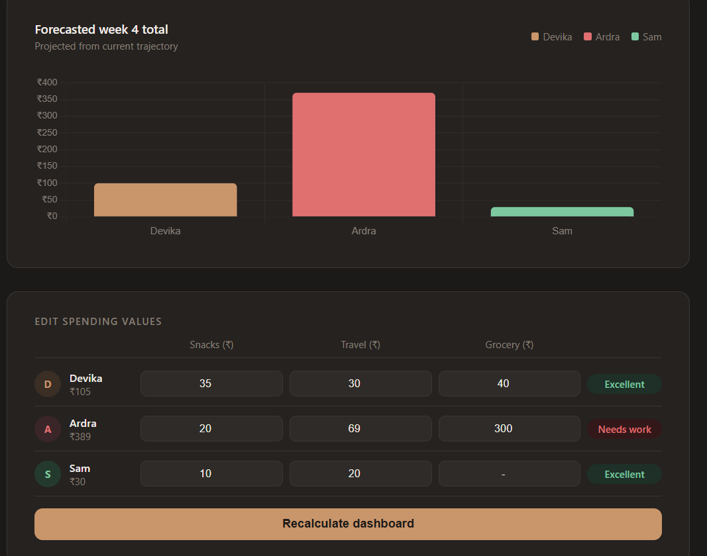

# TrackTact — Smart Budget Dashboard

> A dark-themed, interactive budget tracking dashboard with live score calculation, anomaly detection, and spending forecasts.


---

## Preview

<!-- Add a screenshot here after opening index.html in browser -->
<!-- Steps: Open index.html → take a screenshot → save as preview.png → upload to repo -->



---

## Features

- **Live score calculation** — saver scores update dynamically based on group average
- **Interactive inputs** — edit any spend value and recalculate instantly
- **Grouped bar chart** — visual breakdown of Snacks, Travel, and Grocery per person
- **Week 4 forecast** — projected spending from current trajectory
- **Anomaly detection** — flags unusually high or low category spends automatically
- **Smart suggestions** — personalised tips generated per user based on their data
- **Warm charcoal + rose gold UI** — custom dark theme, no external CSS framework

---

## Getting started

No installation needed. Just open the file in any browser.

```bash
# Clone the repo
git clone https://github.com/SAMYUKTHASRR/tracktact-dashboard.git

# Open in browser
open index.html
```

Or simply [download the ZIP](https://github.com/SAMYUKTHASRR/tracktact-dashboard/archive/refs/heads/main.zip) and open `index.html`.

---

## How it works

| Section | What it does |
|---|---|
| Stat cards | Shows lowest spender, group average, and highest spender — updates live |
| Category chart | Grouped bar chart comparing Snacks / Travel / Grocery per person |
| Forecast chart | Projects week 4 spend at 95% of current weekly total |
| Edit panel | Input fields for each category — hit Recalculate to refresh everything |
| Anomalies | Auto-detects spends that deviate >50% above or 60% below group average |
| Suggestions | Rule-based tips tailored to each person's spending pattern |

---

## Project structure

```
tracktact-dashboard/
└── index.html       # All HTML, CSS, and JS in one file
└── README.md
└── preview.png      # Screenshot (add after first run)
```

---

## Built with

- Vanilla HTML, CSS, JavaScript — zero dependencies
- [Chart.js](https://www.chartjs.org/) via CDN for charts
- [Tabler Icons](https://tabler.io/icons) via CDN for icons

---

## About

Built as part of a data analytics mini-project exploring budget patterns and spending behaviour. Designed with a focus on clean UI/UX — dark theme, high contrast, and meaningful data visualisation over static tables.

---

*Made by [Samyuktha Sanil](https://github.com/SAMYUKTHASRR)*
